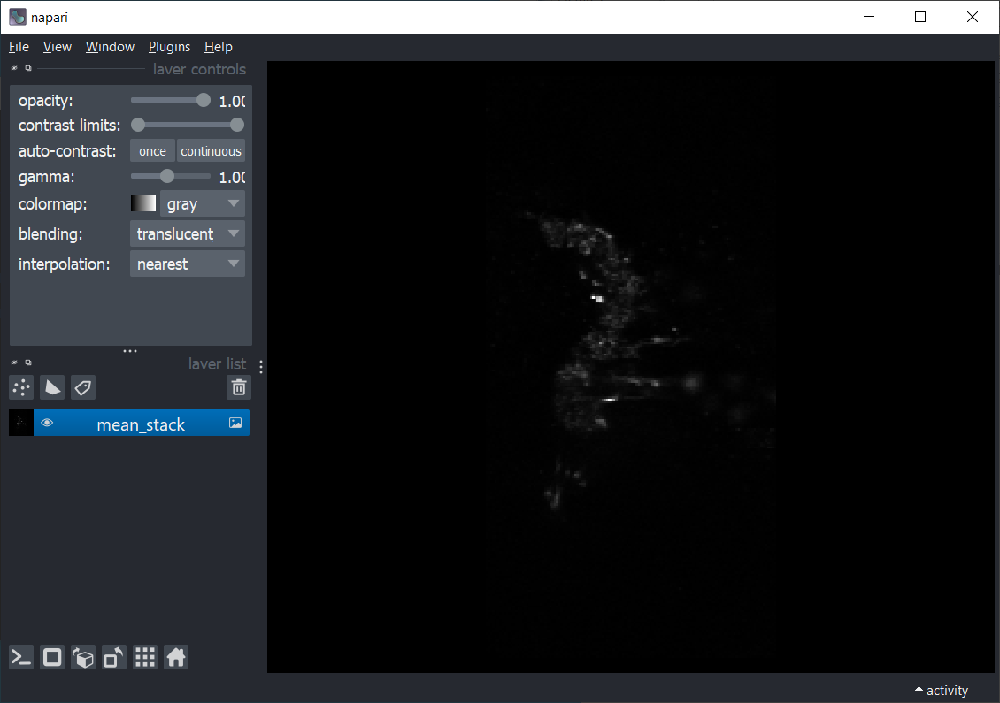
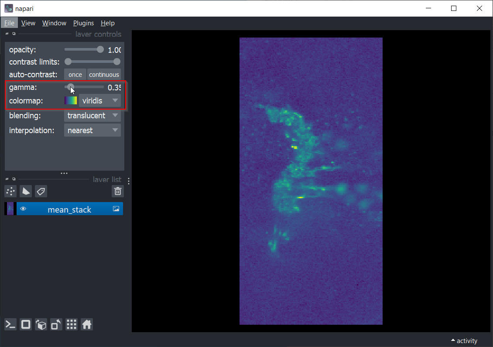
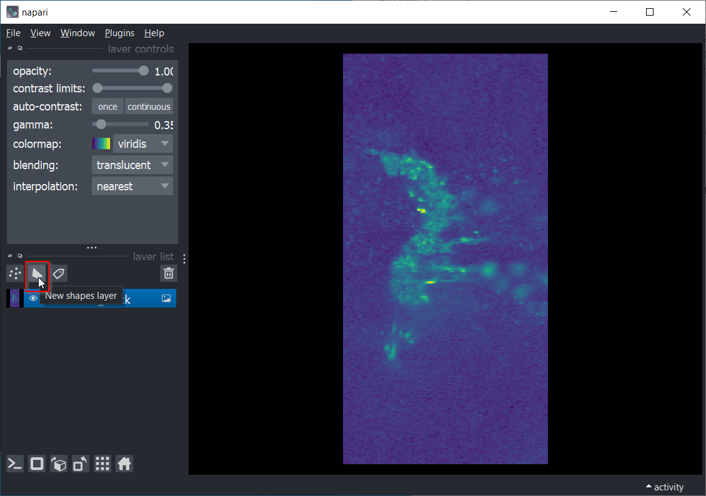
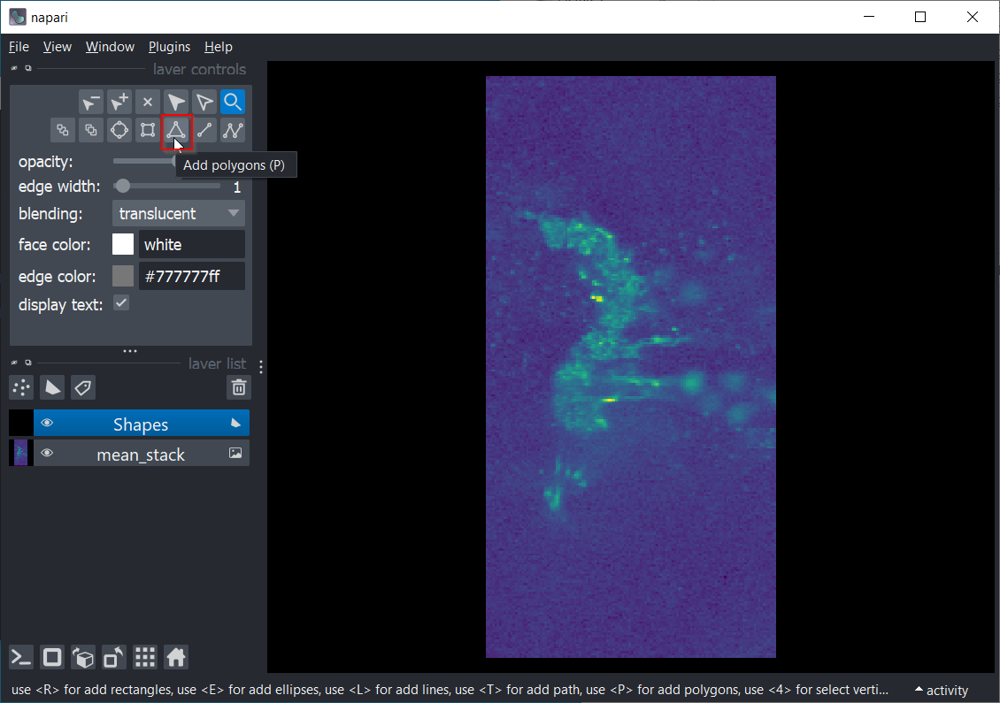
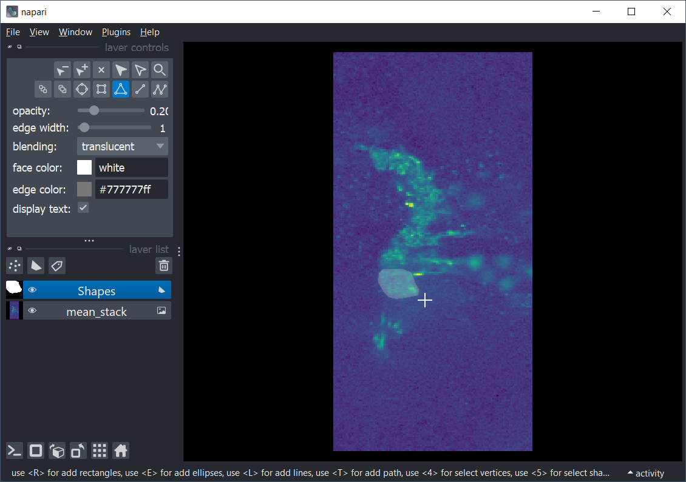
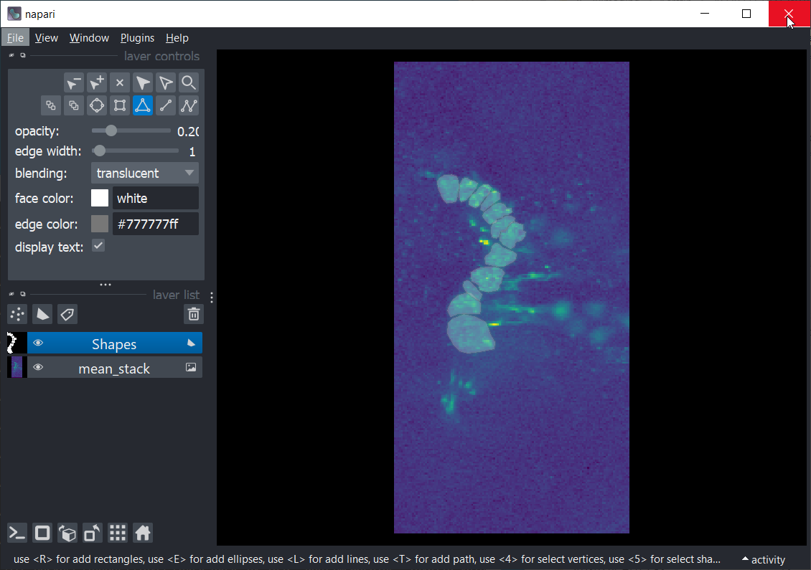
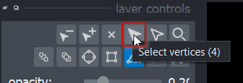
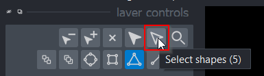
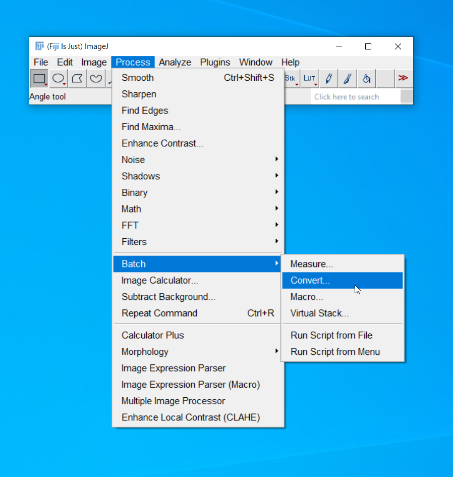
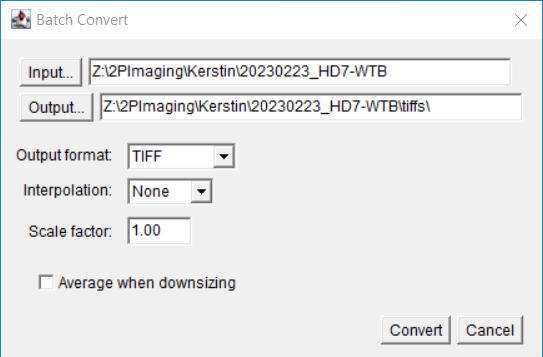

# Glutamate Puffing Analysis


## Table of Contents
- [Setup](#setup)
- [Usage](#usage)
  - [How to batch convert .oif files to .tif files:](#how-to-batch-convert-oif-files-to-tif-files)

## Setup

* Download [Anaconda](https://www.anaconda.com/products/distribution)

* Setup anaconda environment with the following commands:

```bash
conda create -n glupuff python=3.8 pip
conda activate glupuff
cd path/to/glu-puff-analysis
pip install -U -r requirements.txt
```


## Usage

Windows: run **RunPipeline.bat**<br>
Mac: run **RunPipeline.sh**

A file explorer will open, select the trials you would like to analyze.<br>
(You can select multiple files by holding control when selecting)

You will need you trials in a tif format, here's [how to convert them](#how-to-batch-convert-oif-files-to-tif-files)

Once you've selected your file(s) a window will open up to draw ROI's.<br>


It is usefull to decrease the gamma slider to improve brightness and switch the colormap to viridis for better clarity.<br>


Select the New Shapes Layer button to create a layer to draw ROI's in.<br>


Select the polygon tool to draw ROI's. You can also press <kbd>P</kbd> to select it.<br>
(It is also helpful to lower the opacity slider so you can see the image behind the ROI)<br>


To draw an ROI, click around your region. Hit <kbd>Esc</kbd> to finish drawing the shape<br>


Once all ROI's are drawn, close the window to save them<br>


If multiple files were selected for analysis a new window will open with the next trial.<br>
The previously drawn ROI's will be overlayed on the new trial. You can adjust them using the select vertices and select shapes tools to move a vertex or the entire shape.<br> 



After ROI's are drawn for all trials, another file explorer will open asking for the folder to store the figures in.

<br>

### How to batch convert .oif files to .tif files:
You will need to convert .oif files to .tif files before running the pipeline. Here's how to convert a bunch at once:

* Open Fiji
* Select Process > Batch > Convert



* Add the folder with .oif files you would like to convert to the input.<br>
  Then add the folder you would like to save your files in to the output.<br>
  I like to add a tiffs folder in the same folder as the original .oifs to store them.



* Select Convert<br>
  Note: errors will show up in the log as files are converted. This is fine.

* The tiffs will show up in the output folder

* Now you are ready to use the tiffs for the pipeline!